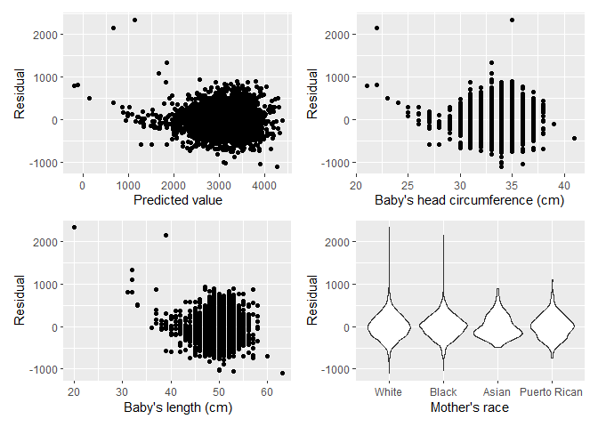
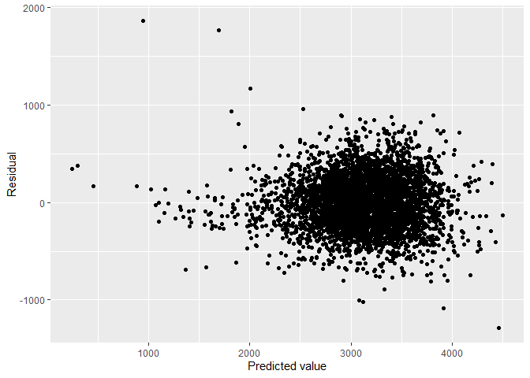
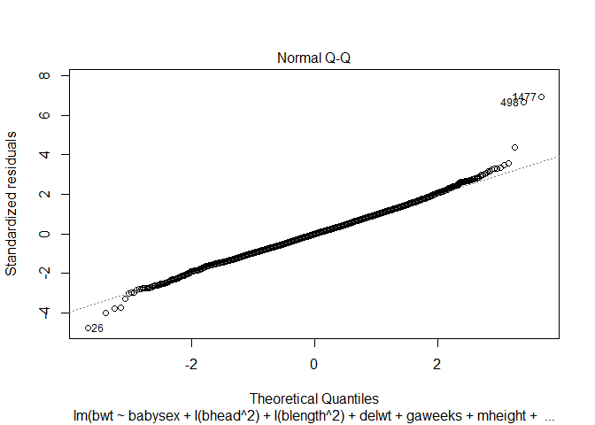
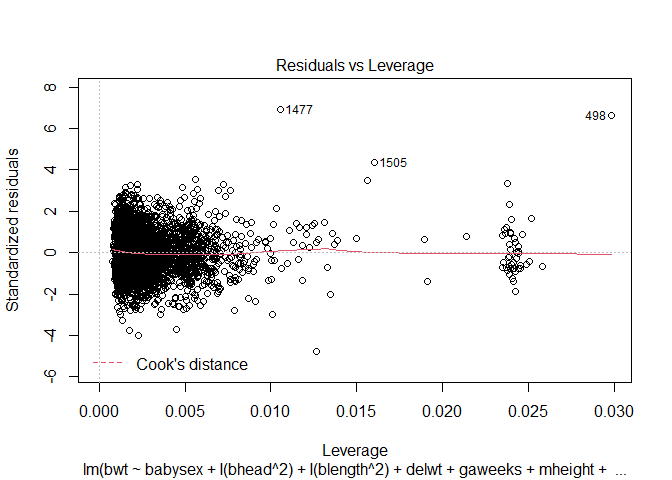
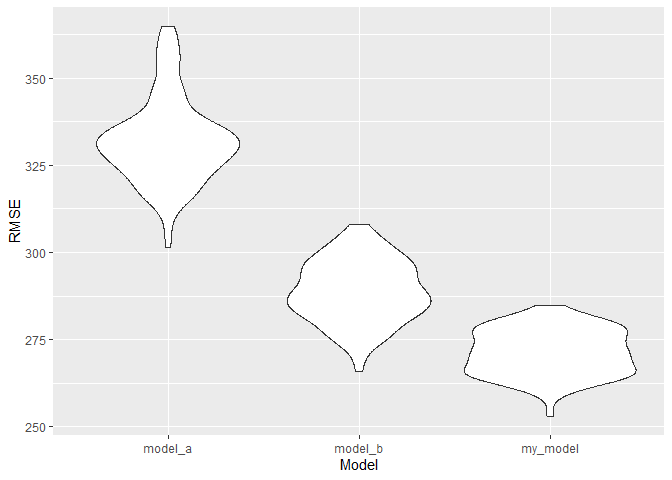
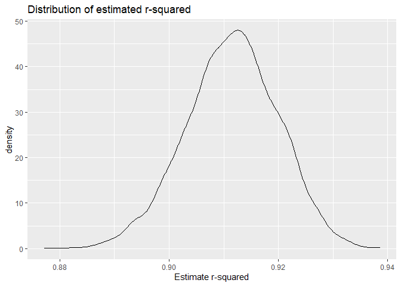
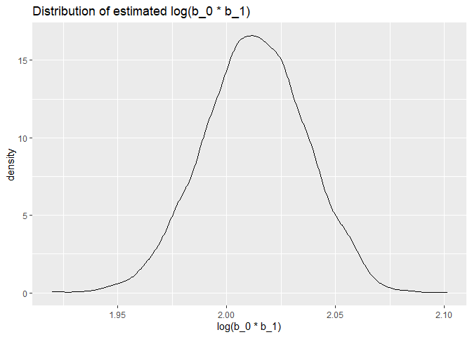

P8105 Homework 6
================
Jesse R. Ames
12/4/2021

## Problem 1

### Load and clean the data

``` r
library(tidyverse)
```

    ## -- Attaching packages --------------------------------------- tidyverse 1.3.1 --

    ## v ggplot2 3.3.5     v purrr   0.3.4
    ## v tibble  3.1.4     v dplyr   1.0.7
    ## v tidyr   1.1.3     v stringr 1.4.0
    ## v readr   2.0.1     v forcats 0.5.1

    ## -- Conflicts ------------------------------------------ tidyverse_conflicts() --
    ## x dplyr::filter() masks stats::filter()
    ## x dplyr::lag()    masks stats::lag()

``` r
birthweight <- read_csv("data/birthweight.csv")
```

    ## Rows: 4342 Columns: 20

    ## -- Column specification --------------------------------------------------------
    ## Delimiter: ","
    ## dbl (20): babysex, bhead, blength, bwt, delwt, fincome, frace, gaweeks, malf...

    ## 
    ## i Use `spec()` to retrieve the full column specification for this data.
    ## i Specify the column types or set `show_col_types = FALSE` to quiet this message.

``` r
skimr::skim(birthweight)
```

|                                                  |             |
|:-------------------------------------------------|:------------|
| Name                                             | birthweight |
| Number of rows                                   | 4342        |
| Number of columns                                | 20          |
| \_\_\_\_\_\_\_\_\_\_\_\_\_\_\_\_\_\_\_\_\_\_\_   |             |
| Column type frequency:                           |             |
| numeric                                          | 20          |
| \_\_\_\_\_\_\_\_\_\_\_\_\_\_\_\_\_\_\_\_\_\_\_\_ |             |
| Group variables                                  | None        |

Data summary

**Variable type: numeric**

| skim\_variable | n\_missing | complete\_rate |    mean |     sd |     p0 |     p25 |     p50 |     p75 |   p100 | hist  |
|:---------------|-----------:|---------------:|--------:|-------:|-------:|--------:|--------:|--------:|-------:|:------|
| babysex        |          0 |              1 |    1.49 |   0.50 |   1.00 |    1.00 |    1.00 |    2.00 |    2.0 | ▇▁▁▁▇ |
| bhead          |          0 |              1 |   33.65 |   1.62 |  21.00 |   33.00 |   34.00 |   35.00 |   41.0 | ▁▁▆▇▁ |
| blength        |          0 |              1 |   49.75 |   2.72 |  20.00 |   48.00 |   50.00 |   51.00 |   63.0 | ▁▁▁▇▁ |
| bwt            |          0 |              1 | 3114.40 | 512.15 | 595.00 | 2807.00 | 3132.50 | 3459.00 | 4791.0 | ▁▁▇▇▁ |
| delwt          |          0 |              1 |  145.57 |  22.21 |  86.00 |  131.00 |  143.00 |  157.00 |  334.0 | ▅▇▁▁▁ |
| fincome        |          0 |              1 |   44.11 |  25.98 |   0.00 |   25.00 |   35.00 |   65.00 |   96.0 | ▃▇▅▂▃ |
| frace          |          0 |              1 |    1.66 |   0.85 |   1.00 |    1.00 |    2.00 |    2.00 |    8.0 | ▇▁▁▁▁ |
| gaweeks        |          0 |              1 |   39.43 |   3.15 |  17.70 |   38.30 |   39.90 |   41.10 |   51.3 | ▁▁▂▇▁ |
| malform        |          0 |              1 |    0.00 |   0.06 |   0.00 |    0.00 |    0.00 |    0.00 |    1.0 | ▇▁▁▁▁ |
| menarche       |          0 |              1 |   12.51 |   1.48 |   0.00 |   12.00 |   12.00 |   13.00 |   19.0 | ▁▁▂▇▁ |
| mheight        |          0 |              1 |   63.49 |   2.66 |  48.00 |   62.00 |   63.00 |   65.00 |   77.0 | ▁▁▇▂▁ |
| momage         |          0 |              1 |   20.30 |   3.88 |  12.00 |   18.00 |   20.00 |   22.00 |   44.0 | ▅▇▂▁▁ |
| mrace          |          0 |              1 |    1.63 |   0.77 |   1.00 |    1.00 |    2.00 |    2.00 |    4.0 | ▇▇▁▁▁ |
| parity         |          0 |              1 |    0.00 |   0.10 |   0.00 |    0.00 |    0.00 |    0.00 |    6.0 | ▇▁▁▁▁ |
| pnumlbw        |          0 |              1 |    0.00 |   0.00 |   0.00 |    0.00 |    0.00 |    0.00 |    0.0 | ▁▁▇▁▁ |
| pnumsga        |          0 |              1 |    0.00 |   0.00 |   0.00 |    0.00 |    0.00 |    0.00 |    0.0 | ▁▁▇▁▁ |
| ppbmi          |          0 |              1 |   21.57 |   3.18 |  13.07 |   19.53 |   21.03 |   22.91 |   46.1 | ▃▇▁▁▁ |
| ppwt           |          0 |              1 |  123.49 |  20.16 |  70.00 |  110.00 |  120.00 |  134.00 |  287.0 | ▅▇▁▁▁ |
| smoken         |          0 |              1 |    4.15 |   7.41 |   0.00 |    0.00 |    0.00 |    5.00 |   60.0 | ▇▁▁▁▁ |
| wtgain         |          0 |              1 |   22.08 |  10.94 | -46.00 |   15.00 |   22.00 |   28.00 |   89.0 | ▁▁▇▁▁ |

No missing data, but we might want to convert some `numeric` columns to
`factor`

``` r
bw <- birthweight %>%
  mutate(
    babysex = as.character(babysex),
    babysex = fct_recode(babysex, Male = "1", Female = "2"),
    
    frace = as.character(frace),
    frace = fct_recode(frace, White = "1", Black = "2", Asian = "3",
                            "Puerto Rican" = "4", Other = "8", Unknown = "9"),
    
    mrace = as.character(mrace),
    mrace = fct_recode(mrace, White = "1", Black = "2", Asian = "3",
                            "Puerto Rican" = "4", Other = "8"),
    
    malform = as.logical(malform)
  )
```

    ## Warning: Unknown levels in `f`: 9

    ## Warning: Unknown levels in `f`: 8

### Multiple linear regression

We seem to have a lot of variables here, and a lot of possible
interactions. We want to create a model that is both parsimonious and
explanatorily powerful. Accordingly, I will choose my model using BIC,
starting from the full model (all linear terms, no interactions) and
working backward. I will then compare this model’s predictive power
against two suggested models:

-   Model A, with just length at birth and gestational age
-   Model B, with head circumference, length, sex, and all interactions
    between these three

``` r
big_model <- lm(bwt~., data = bw)
step_bic <- step(big_model, trace = 0, k = log(nobs(big_model)), direction = "backward")
summary(step_bic)
```

    ## 
    ## Call:
    ## lm(formula = bwt ~ babysex + bhead + blength + delwt + gaweeks + 
    ##     mheight + mrace + ppwt + smoken, data = bw)
    ## 
    ## Residuals:
    ##      Min       1Q   Median       3Q      Max 
    ## -1104.52  -183.71    -2.92   174.58  2336.55 
    ## 
    ## Coefficients:
    ##                     Estimate Std. Error t value Pr(>|t|)    
    ## (Intercept)       -6090.6410   137.5628 -44.275  < 2e-16 ***
    ## babysexFemale        28.9272     8.4577   3.420 0.000631 ***
    ## bhead               131.1745     3.4460  38.065  < 2e-16 ***
    ## blength              74.7285     2.0187  37.018  < 2e-16 ***
    ## delwt                 4.1053     0.3921  10.471  < 2e-16 ***
    ## gaweeks              11.4086     1.4579   7.825 6.32e-15 ***
    ## mheight               6.8133     1.7803   3.827 0.000132 ***
    ## mraceBlack         -145.4960     9.2303 -15.763  < 2e-16 ***
    ## mraceAsian          -78.1687    42.3138  -1.847 0.064764 .  
    ## mracePuerto Rican  -106.5370    19.1169  -5.573 2.66e-08 ***
    ## ppwt                 -2.6726     0.4274  -6.253 4.40e-10 ***
    ## smoken               -4.8782     0.5858  -8.327  < 2e-16 ***
    ## ---
    ## Signif. codes:  0 '***' 0.001 '**' 0.01 '*' 0.05 '.' 0.1 ' ' 1
    ## 
    ## Residual standard error: 272.5 on 4330 degrees of freedom
    ## Multiple R-squared:  0.7175, Adjusted R-squared:  0.7168 
    ## F-statistic: 999.9 on 11 and 4330 DF,  p-value: < 2.2e-16

This model includes the baby’s sex, head circumference, and length, and
the mother’s weight at delivery, weight pre-pregnancy, height, race, and
cigarette consumption during pregnancy. Do we violate any assumptions?

``` r
library(patchwork)
bw_fit <- bw %>%
  modelr::add_residuals(step_bic) %>%
  modelr::add_predictions(step_bic)

pred_resid <- bw_fit %>%
  ggplot(aes(x = pred, y = resid)) + geom_point() + labs(x = "Predicted value", y = "Residual")

head_resid <- bw_fit %>%
  ggplot(aes(x = bhead, y = resid)) + geom_point() + labs(x = "Baby's head circumference (cm)",
                                                          y = "Residual")
len_resid <- bw_fit %>%
  ggplot(aes(x = blength, y = resid)) + geom_point() + labs(x = "Baby's length (cm)", y = "Residual")

race_resid <- bw_fit %>%
  ggplot(aes(x = mrace, y = resid)) + geom_violin() + labs(x = "Mother's race", y = "Residual")

(pred_resid + head_resid)/(len_resid + race_resid)
```

<!-- -->

It seems like we have a bit of curvature in our residuals. Try raising
the power of `bhead` and `blength`

``` r
fit2 <- lm(bwt ~ babysex + I(bhead^2) + I(blength^2) + delwt + gaweeks +
             mheight + mrace + ppwt + smoken, data = bw)
summary(fit2)
```

    ## 
    ## Call:
    ## lm(formula = bwt ~ babysex + I(bhead^2) + I(blength^2) + delwt + 
    ##     gaweeks + mheight + mrace + ppwt + smoken, data = bw)
    ## 
    ## Residuals:
    ##     Min      1Q  Median      3Q     Max 
    ## -1283.2  -182.8    -3.2   176.7  1863.5 
    ## 
    ## Coefficients:
    ##                     Estimate Std. Error t value Pr(>|t|)    
    ## (Intercept)       -2.169e+03  1.174e+02 -18.473  < 2e-16 ***
    ## babysexFemale      3.293e+01  8.407e+00   3.917 9.12e-05 ***
    ## I(bhead^2)         1.980e+00  5.148e-02  38.468  < 2e-16 ***
    ## I(blength^2)       7.924e-01  2.058e-02  38.508  < 2e-16 ***
    ## delwt              4.020e+00  3.895e-01  10.321  < 2e-16 ***
    ## gaweeks            1.218e+01  1.443e+00   8.442  < 2e-16 ***
    ## mheight            6.378e+00  1.768e+00   3.607 0.000314 ***
    ## mraceBlack        -1.413e+02  9.175e+00 -15.398  < 2e-16 ***
    ## mraceAsian        -7.376e+01  4.202e+01  -1.756 0.079244 .  
    ## mracePuerto Rican -1.058e+02  1.898e+01  -5.576 2.62e-08 ***
    ## ppwt              -2.668e+00  4.244e-01  -6.287 3.56e-10 ***
    ## smoken            -4.613e+00  5.822e-01  -7.924 2.91e-15 ***
    ## ---
    ## Signif. codes:  0 '***' 0.001 '**' 0.01 '*' 0.05 '.' 0.1 ' ' 1
    ## 
    ## Residual standard error: 270.6 on 4330 degrees of freedom
    ## Multiple R-squared:  0.7215, Adjusted R-squared:  0.7208 
    ## F-statistic:  1020 on 11 and 4330 DF,  p-value: < 2.2e-16

``` r
bw_fit2 <- bw %>%
  modelr::add_residuals(fit2) %>%
  modelr::add_predictions(fit2)

bw_fit2 %>%
  ggplot(aes(x = pred, y = resid)) + geom_point() + labs(x = "Predicted value", y = "Residual")
```

<!-- -->

Slightly better. What about normality? Leverage?

``` r
(plot(fit2, which = 2) + plot(fit2, which = 5))
```

<!-- --><!-- -->

    ## integer(0)

Normality assumption holds. There are a few influential-looking points,
but none with a Cook’s D of more than 0.5. I will use this as my model
going forward.

### Cross-validation

Now we compare the models in terms of their average root mean square
error (RMSE) on 100 random 80-20 splits of the data (80% training, 20%
testing).

``` r
library(modelr)
set.seed(15)
cv_df <- crossv_mc(bw, 100)
    
cv_df <- cv_df %>% 
  mutate(
    model_a  = map(train, ~lm(bwt ~ blength + gaweeks, data = .x)),
    model_b  = map(train, ~lm(bwt ~ (bhead + blength + babysex)^2 + bhead*blength*babysex,
                              data = .x )),
    my_model = map(train, ~lm(bwt ~ babysex + I(bhead^2) + I(blength^2) + delwt + gaweeks +
             mheight + mrace + ppwt + smoken, data = .x))) %>% 
  mutate(
    rmse_model_a = map2_dbl(model_a, test, ~rmse(model = .x, data = .y)),
    rmse_model_b = map2_dbl(model_b, test, ~rmse(model = .x, data = .y)),
    rmse_my_model = map2_dbl(my_model, test, ~rmse(model = .x, data = .y)))

cv_df %>% 
  select(starts_with("rmse")) %>% 
  pivot_longer(
    everything(),
    names_to = "model", 
    values_to = "rmse",
    names_prefix = "rmse_") %>% 
  mutate(model = fct_inorder(model)) %>% 
  ggplot(aes(x = model, y = rmse)) + geom_violin() + labs(x = "Model", y = "RMSE")
```

<!-- -->

It looks like my model performs the best on average of these three
models, though Model B was relatively close.

## Problem 2

### Download the data

``` r
weather_df = 
  rnoaa::meteo_pull_monitors(
    c("USW00094728"),
    var = c("PRCP", "TMIN", "TMAX"), 
    date_min = "2017-01-01",
    date_max = "2017-12-31") %>%
  mutate(
    name = recode(id, USW00094728 = "CentralPark_NY"),
    tmin = tmin / 10,
    tmax = tmax / 10) %>%
  select(name, id, everything())
```

    ## Registered S3 method overwritten by 'hoardr':
    ##   method           from
    ##   print.cache_info httr

    ## using cached file: C:\Users\User\AppData\Local/Cache/R/noaa_ghcnd/USW00094728.dly

    ## date created (size, mb): 2021-10-05 10:32:24 (7.617)

    ## file min/max dates: 1869-01-01 / 2021-10-31

### Boostrap estimates

``` r
#Bootstrapping is named for the fictional Baron von Munchausen,
#who pulled himself up by his bootstraps when his horse got stuck in the mud

set.seed(15)
munchausen <- weather_df %>%
  modelr::bootstrap(n = 5000) %>%
  mutate(
    models = map(strap, ~lm(tmax ~ tmin, data = .x) ),
    results = map(models, broom::tidy),
    summary = map(models, broom::glance)) %>% 
  select(-strap, -models) %>% 
  unnest(results) %>%
  pivot_wider(names_from = term, values_from = estimate:p.value) %>%
  mutate(
    log_prod = log(`estimate_(Intercept)` * estimate_tmin)
  ) %>%
  unnest(summary)
  
#Plot distributions
munchausen %>%
  ggplot(aes(x = r.squared)) + geom_density() +
    labs(x = "Estimate r-squared", title = "Distribution of estimated r-squared")
```

<!-- -->

``` r
munchausen %>%
  ggplot(aes(x = log_prod)) + geom_density() +
  labs(x = "log(b_0 * b_1)", title = "Distribution of estimated log(b_0 * b_1)")
```

<!-- -->

``` r
#Confidence interval - r-squared
lower <- munchausen %>% pull(r.squared) %>% quantile(0.025)
upper <- munchausen %>% pull(r.squared) %>% quantile(0.975)
c(lower, upper)
```

    ##      2.5%     97.5% 
    ## 0.8940542 0.9273297

``` r
#Confidence interval - log(B_0 * B_1)
lower2 <- munchausen %>% pull(log_prod) %>% quantile(0.025)
upper2 <- munchausen %>% pull(log_prod) %>% quantile(0.975)
c(lower2, upper2)
```

    ##     2.5%    97.5% 
    ## 1.965990 2.057809

The distributions of our bootstrap estimates for *r̂*<sup>2</sup> and
$\\log(\\hat{\\beta\_0}\*\\hat{\\beta\_1})$ are each roughly bell-shaped
and unimodal, with a slightly steeper bell shape than a normal
distribution. The distribution of *r̂*<sup>2</sup> is centered at 0.912
and the distribution of $\\log(\\hat{\\beta\_0}\*\\hat{\\beta\_1})$ is
centered at 2.013.
